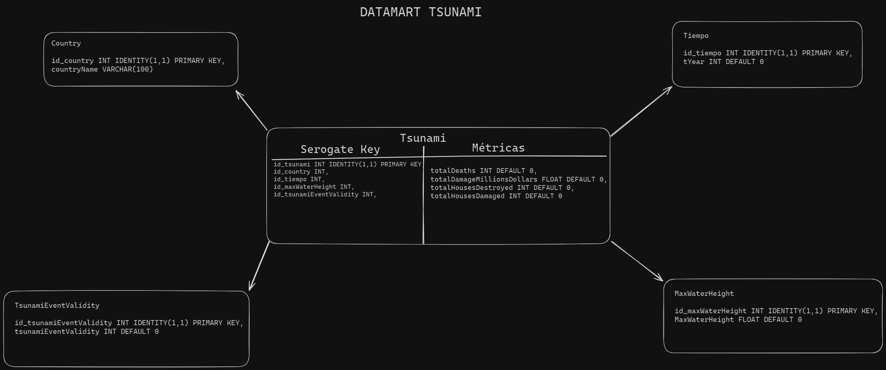

# <div align="center"> MANUAL TÉCNICO </div>
### <div align="center"> Práctica 1 - Seminario de Sistemas 2</div>
```
Nombre: Allen Giankarlo Román Vásquez
Carnet: 202004745
```

# **Datamart de Tsunamis** 

El objetivo del proyecto es desarrollar un datamart de tsunamis, el cual permita registrar los tsunamis que han ocurrido en el mundo, así como también consultarlos, obteniendo información relevante de cada uno de ellos.

## **Modelo Utilizado**

<p align="center">
  
</p>

## **Estructura de la Base de Datos**

Para extraer la información de los tsunamis del archivo CSV, se creó una base de datos en SQL Server, la cual contiene las siguientes tablas:

- Tabla temporal
- Tabla Tiempo
- Tabla Tsunami
- Tabla Country
- Tabla TsunamiEventValidity
- Tabla TsunamiMaxWaterHeight

#### **Tabla Temporal**

La tabla temporal se creó para almacenar la información del archivo CSV, la cual se utilizará para insertar la información transformada en las demás tablas.

```

CREATE TABLE temporal(
tYear INT DEFAULT 0,
tMonth INT DEFAULT 0,
tDay INT DEFAULT 0,
tHour INT DEFAULT 0,
tMinute INT DEFAULT 0,
tSecond FLOAT DEFAULT 0,
tsunamiEventValidity INT DEFAULT 0,
tsunamiCauseCode INT DEFAULT 0,
tsunamiEarthquakeMagnitude FLOAT DEFAULT 0,
tsunamiDeposits INT DEFAULT 0,
Latitude FLOAT DEFAULT 0,
Longitude FLOAT DEFAULT 0,
MaxWaterHeight FLOAT DEFAULT 0,
NumberRunups INT DEFAULT 0,
tsunamiMagnitudes FLOAT DEFAULT 0,
tsunamiIntensity FLOAT DEFAULT 0,
totalDeaths INT DEFAULT 0,
totalMissing INT DEFAULT 0,
totalMissingDescription VARCHAR(100) DEFAULT '',
totalInjuries INT DEFAULT 0,
totalDamageMillionsDollars FLOAT DEFAULT 0,
totalDamageDescription VARCHAR(100),
totalHousesDestroyed INT DEFAULT 0,
totalHousesDamaged INT DEFAULT 0,
Country VARCHAR(100) DEFAULT '',
locationName VARCHAR(100) DEFAULT ''
);
```

#### **Tabla Country**


```
CREATE TABLE Country(
    id_country INT IDENTITY(1,1) PRIMARY KEY,
    countryName VARCHAR(100)
);
```

#### **Tabla Tiempo**

```

CREATE TABLE Tiempo(
    id_tiempo INT IDENTITY(1,1) PRIMARY KEY,
    tYear INT DEFAULT 0
);

```

#### **Tabla MaxWaterHeight**

```
CREATE TABLE MaxWaterHeight(
    id_maxWaterHeight INT IDENTITY(1,1) PRIMARY KEY,
    MaxWaterHeight FLOAT DEFAULT 0
);

```

#### **Tabla TsunamiEventValidity**

```
CREATE TABLE TsunamiEventValidity(
    id_tsunamiEventValidity INT IDENTITY(1,1) PRIMARY KEY,
    tsunamiEventValidity INT DEFAULT 0
);
```

#### **Tabla Tsunami**

```

CREATE TABLE Tsunami(
    id_tsunami INT IDENTITY(1,1) PRIMARY KEY,
    id_country INT,
    id_tiempo INT,
    id_maxWaterHeight INT,
    id_tsunamiEventValidity INT,
    totalDeaths INT DEFAULT 0,
    totalDamageMillionsDollars FLOAT DEFAULT 0,
    totalHousesDestroyed INT DEFAULT 0,
    totalHousesDamaged INT DEFAULT 0
    FOREIGN KEY (id_country) REFERENCES Country(id_country),
    FOREIGN KEY (id_tiempo) REFERENCES Tiempo(id_tiempo),
    FOREIGN KEY (id_maxWaterHeight) REFERENCES MaxWaterHeight(id_maxWaterHeight),
    FOREIGN KEY (id_tsunamiEventValidity) REFERENCES TsunamiEventValidity(id_tsunamiEventValidity)
);
```

### Explicación del Modelo utilizado en el Datamart

El modelo utilizado en el datamart de tsunamis se compone por la tabla de hechos Tsunami, la cual contiene las llaves serogadas de las tablas de dimensiones Country, Tiempo, MaxWaterHeight y TsunamiEventValidity. La tabla de hechos Tsunami contiene información relevante de los tsunamis, como el total de muertes, el total de daños en millones de dólares, el total de casas destruidas y el total de casas dañadas.

Las tablas de dimensiones Country, Tiempo, MaxWaterHeight y TsunamiEventValidity contienen información relevante de los países, el tiempo, la altura máxima del agua y la validez del evento de tsunami, respectivamente.

Se utilizaron las tablas de dimensiones para normalizar la información de la tabla de hechos Tsunami, evitando la redundancia de datos y permitiendo una mejor organización de la información.

Las métricas utilizadas en la tabla de hechos Tsunami son el total de muertes, el total de daños en millones de dólares, el total de casas destruidas y el total de casas dañadas, las cuales permiten obtener información relevante de los tsunamis que han ocurrido en el mundo.

## **Proceso de ETL**

El proceso de ETL se realizó en SQL Server, el cual se compone por las siguientes etapas:

1. **Creación de la tabla temporal:** Se creó una tabla temporal para almacenar la información del archivo CSV. 

2. **Extracción de la información del archivo CSV:** Se extrajo la información del archivo CSV y se insertó en la tabla temporal.

3. **Transformación de la información:** Se transformó la información de la tabla temporal y se insertó en las tablas de dimensiones Country, Tiempo, MaxWaterHeight y TsunamiEventValidity.

4. **Carga de la información:** Se cargó la información transformada en la tabla de hechos Tsunami.

## Consultas

### **Consulta 1: SELECT COUNT(*) de las tablas**

```sql
/*CONSULTA 1*/
SELECT COUNT(*) FROM Country;
SELECT COUNT(*) FROM Tiempo;
SELECT COUNT(*) FROM MaxWaterHeight;
SELECT COUNT(*) FROM TsunamiEventValidity;
SELECT COUNT(*) FROM Tsunami;
SELECT COUNT(*) FROM temporal;
```

### **Consulta 2: Cantidad de tsunamis por año**

```sql
/*CONSULTA 2*/
SELECT t.tYear, COUNT(*) AS CantidadTsunamis
FROM Tsunami ts
INNER JOIN Tiempo t
ON ts.id_tiempo = t.id_tiempo
GROUP BY t.tYear
ORDER BY t.tYear;
```

### **Consulta 3: Tsunamis por país y año**

```sql
/*CONSULTA 3*/
DECLARE @cols AS NVARCHAR(MAX);

DECLARE @query AS NVARCHAR(MAX);

SELECT @cols = STUFF((SELECT ',' + QUOTENAME(tYear)
FROM Tiempo
ORDER BY tYear
FOR XML PATH(''), TYPE
).value('.', 'NVARCHAR(MAX)'),1,1,'');

SET @query = 'SELECT countryName, ' + @cols + ' from
(
SELECT DISTINCT t.tYear, c.countryName
FROM Tsunami ts
INNER JOIN Country c
ON ts.id_country = c.id_country
INNER JOIN Tiempo t
ON ts.id_tiempo = t.id_tiempo
) src
pivot
(
MAX(tYear)
for tYear in (' + @cols + ')
) piv';

EXECUTE(@query);
```

### **Consulta 4: Promedio total de daños en millones de dólares**

```sql
/*CONSULTA 4*/
SELECT c.countryName, AVG(ts.totalDamageMillionsDollars) AS PromedioDanos
FROM Tsunami ts
INNER JOIN Country c
ON ts.id_country = c.id_country
WHERE ts.totalDamageMillionsDollars > 0
GROUP BY c.countryName
ORDER BY PromedioDanos DESC;

```

### **Consulta 5: Top 5 de países con más muertes**

```sql

/*CONSULTA 5*/

SELECT TOP 5 t.Country, SUM(t.totalDeaths) AS TotalMuertes
FROM temporal t
GROUP BY t.Country
ORDER BY TotalMuertes DESC;

```

### **Consulta 6: Top 5 de años con más muertes**

```sql
/*CONSULTA 6*/
SELECT TOP 5 t.tYear, SUM(t.totalDeaths) AS TotalMuertes
FROM temporal t
GROUP BY t.tYear
ORDER BY TotalMuertes DESC;

```

### **Consulta 7: Top 5 de años con más tsunamis**

```sql
/*CONSULTA 7*/
SELECT TOP 5 t.tYear, COUNT(t.tYear) AS TotalTsunamis
FROM temporal t
GROUP BY t.tYear
ORDER BY TotalTsunamis DESC;
```

### **Consulta 8: Top 5 de países con más casas destruidas**

```sql
/*CONSULTA 8*/
SELECT TOP 5 t.Country, SUM(t.totalHousesDestroyed) AS TotalCasasDestruidas
FROM temporal t
GROUP BY t.Country
ORDER BY TotalCasasDestruidas DESC;

```

### **Consulta 9: Top 5 de países con más casas dañadas**

```sql
/*CONSULTA 9*/
SELECT TOP 5 t.Country, SUM(t.totalHousesDamaged) AS TotalCasasDañadas
FROM temporal t
GROUP BY t.Country
ORDER BY TotalCasasDañadas DESC;

```

### **Consulta 10: Promedio de altura máxima del agua por país**
    
```sql
/*CONSULTA 10*/
SELECT t.Country, AVG(t.maxWaterHeight) AS PromedioAlturaMaxima
FROM temporal t
WHERE t.maxWaterHeight > 0
GROUP BY t.Country
ORDER BY PromedioAlturaMaxima DESC;
```


## Flujo de la aplicación desarrollada en Python

El flujo de la aplicación desarrollada en Python se compone por las siguientes etapas:

1. **Borrar modelo:** Se borra el modelo de la base de datos.

2. **Crear modelo:** Se crea el modelo de la base de datos.

3. **Extraer información:** Se extrae la información del archivo CSV y se inserta en la base de datos.

4. **Cargar información:** Se carga la información de la base de datos.

5. **Realizar consultas:** Se realizan las consultas de la base de datos.

6. **Salir:** Se sale de la aplicación.

El punto 5 se repite hasta que el usuario decida salir de la aplicación y despliega un menú con las consultas que se pueden realizar.